# Consulteria  
### Your Career, Our Guidance.

A modern job consultancy and recruitment management platform built using Django.  
Consulteria helps users explore training programs, book consultations, manage profiles, and interact with consultancy services through a clean and user-friendly interface.

---

# 🚀 Features

- User Authentication
- Consultancy Booking System
- Training Programs
- Payment Integration UI
- User Dashboard
- Profile Management
- Admin Panel
- Booking Management
- Payment Management
- Responsive Modern UI

---

# 🛠️ Tech Stack

- Python
- Django
- SQLite
- HTML/CSS
- Bootstrap
- JavaScript

---

# Screenshots

## Home Page
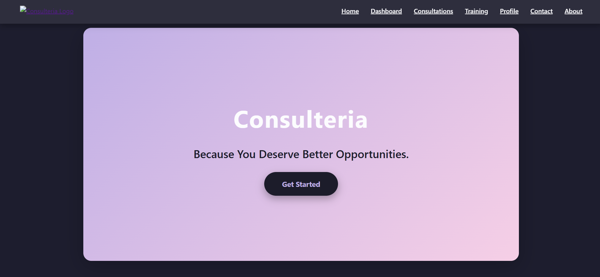

---

## About Page
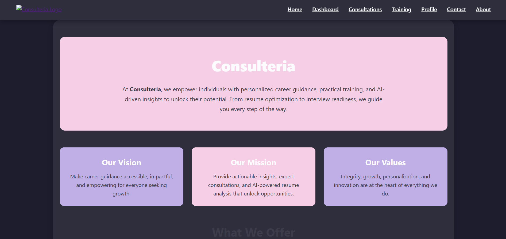

---

## Contact Page
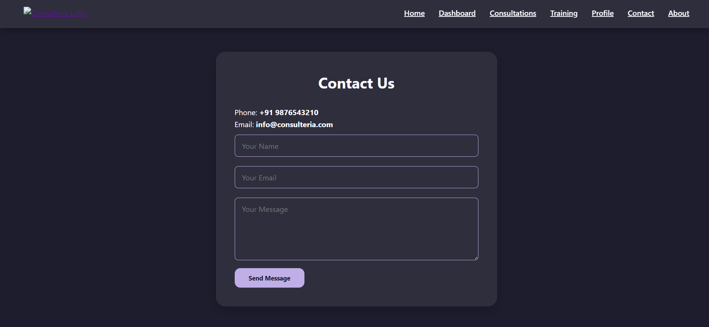

---

## Dashboard
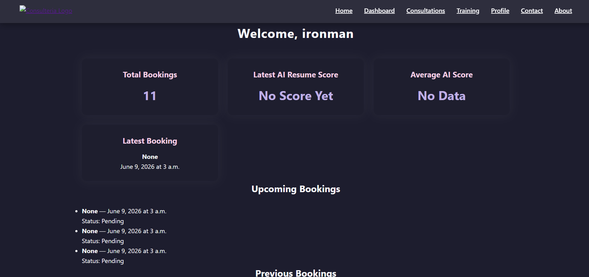

---

## Profile Page
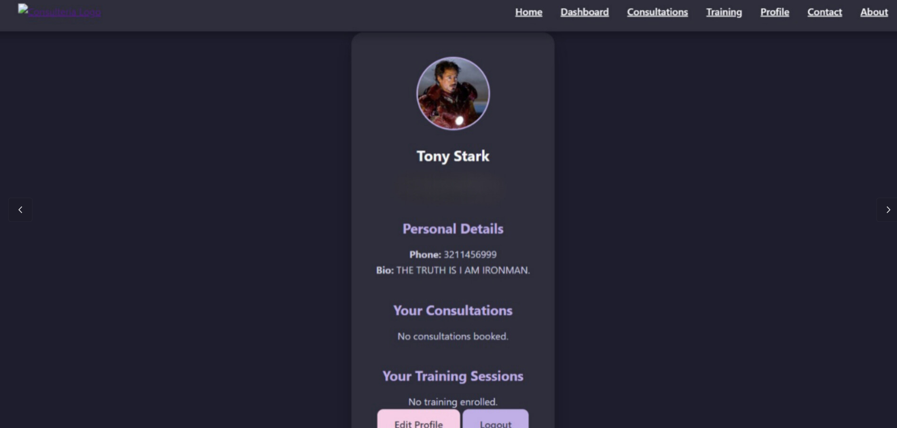

---

## Training Programs
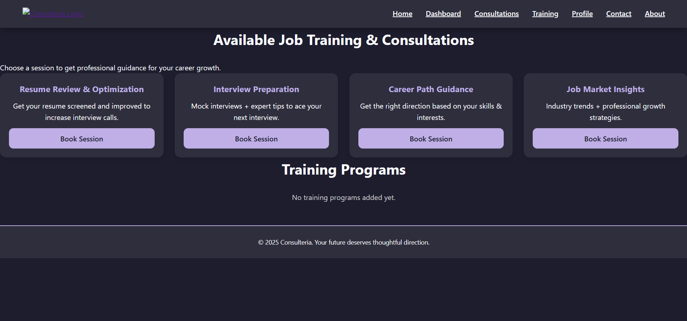

---

## Book Consultation
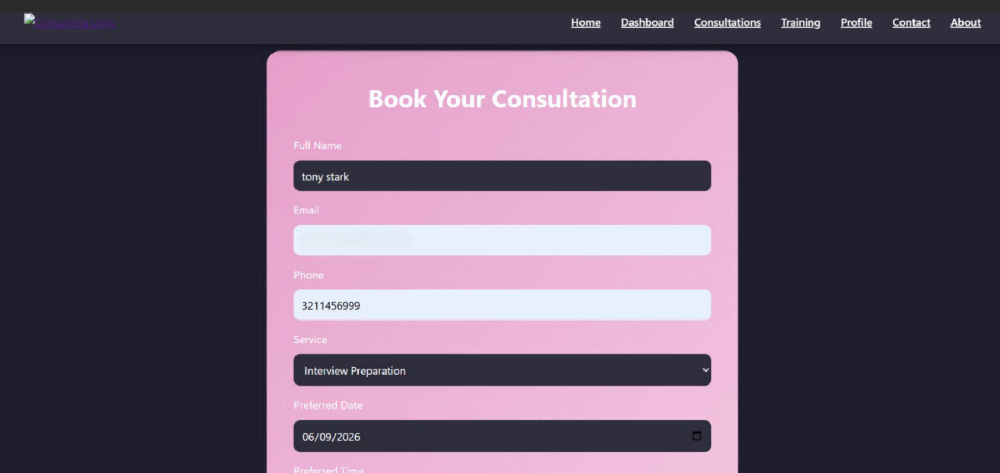

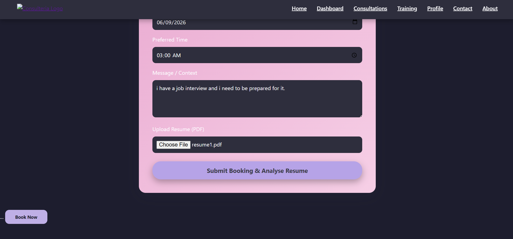

---

## Payment Pages
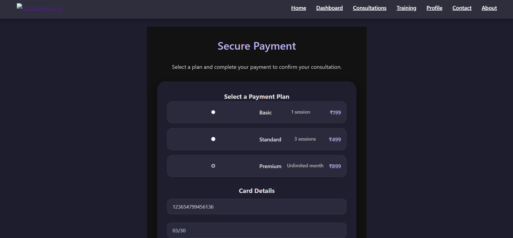


---

## Admin Panel
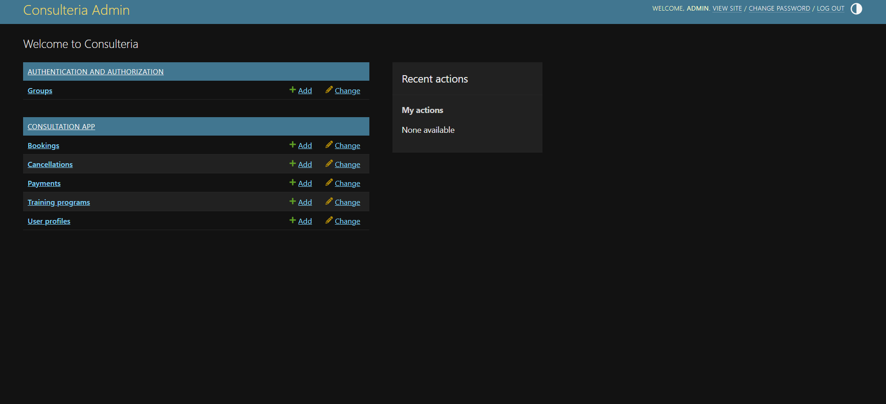

---

## Admin Bookings
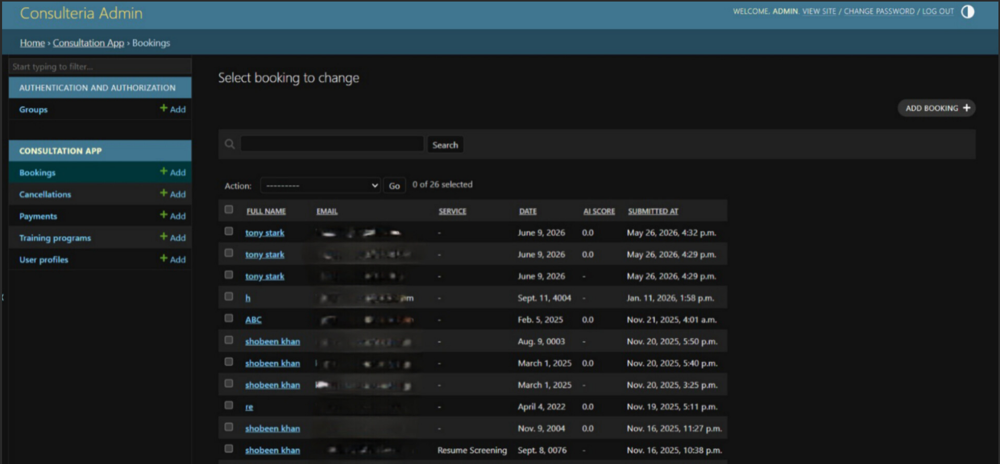

---

## Admin Payments
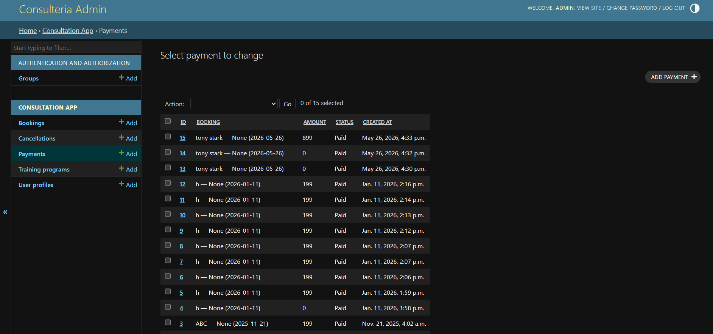

---

# Installation

```bash
git clone https://github.com/your-username/consulteria-jobconsultancy-management-system.git

cd consulteria-jobconsultancy-management-system

pip install -r requirements.txt

python manage.py migrate

python manage.py runserver
```

---
